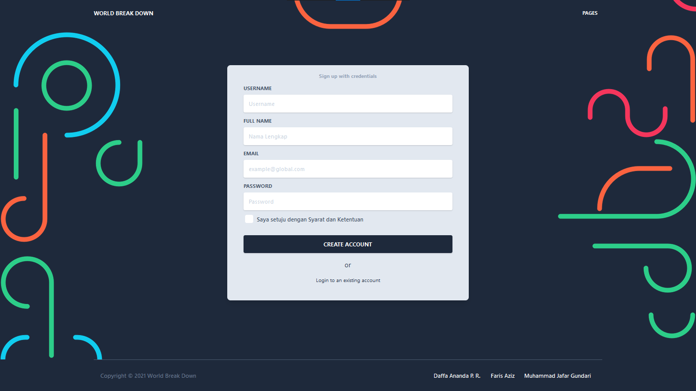
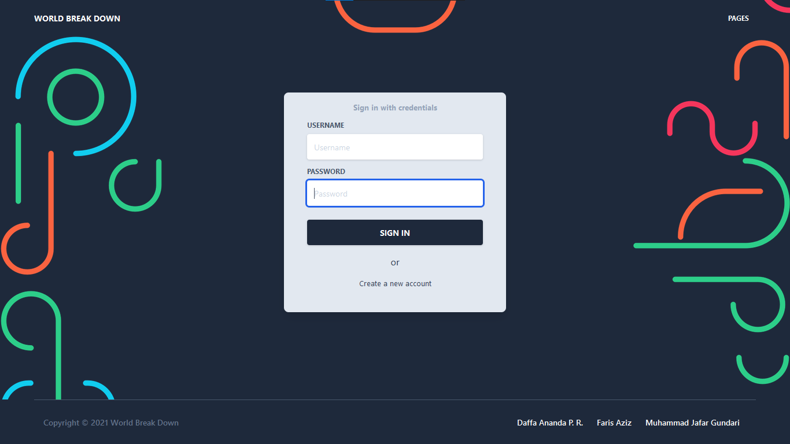
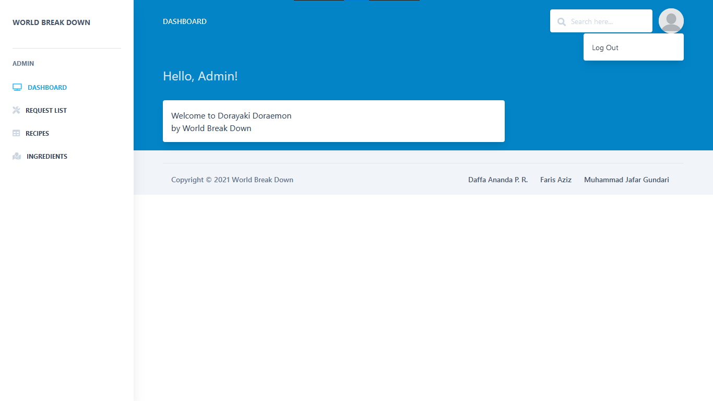
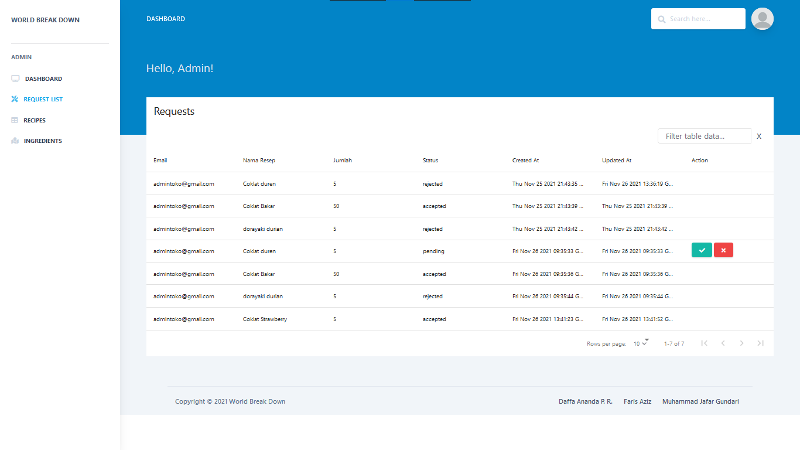
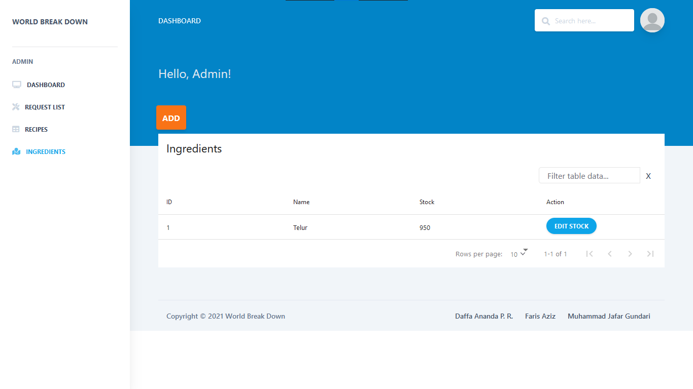

# Dorayaki Factory Client

## Description

Sebuah aplikasi sistem pabrik dorayaki yang digunakan untuk menyuplai website toko dorayaki

## How to Run

- Install NodeJS **LTS** version from <a href="https://nodejs.org/en/?ref=creativetim">NodeJs Official Page</a>
- Download the product on this page
- Unzip the downloaded file to a folder in your computer
- Open Terminal
- Go to your file project (where you’ve unzipped the product)
- (If you are on a linux based terminal) Simply run `npm run install:clean`
- (If not) Run in terminal `npm install`
- (If not) Run in terminal `npm run build:tailwind` (each time you add a new class, a class that does not exist in `src/assets/styles/tailwind.css`, you will need to run this command)
- (If not) Run in terminal `npm start`
- Navigate to https://localhost:3000

## Screenshot

- Register

- Login

- Dashboard

- Request List

- Recipes

- Ingredients

## Pembagian Tugas

- Perubahan halaman edit stok di toko : 13519107
- Perubahan halaman create dorayaki di toko : 13519107
- Palaman login and register di pabrik : 13519107
- Halaman resep di pabrik : 13519065
- Index, detail, create form, edit form : 13519065
- Data : nama, description, array ingredientsObject (id, quantity) : 13519065
- Halaman daftar request di pabrik : 13519197
- Action : accept and decline (put ke request, data diperlukan -> status) : 13519197
- Sort and filter table : 13519197